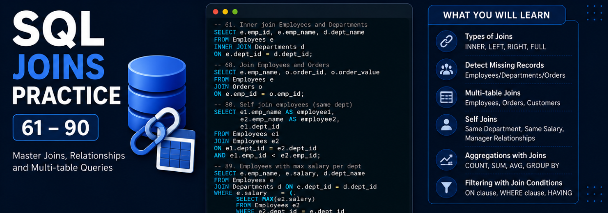

# SQL JOIN Practice Questions (61–90)

This repository contains **SQL JOIN practice questions and solutions (61–90)** using an **Employee Management Database Schema**. It covers different types of joins, self joins, multi-table joins, aggregation with joins, manager relationships, and interview-focused SQL problems.

## Database Schema Used

The queries are based on the following tables:

* **Employees**
* **Departments**
* **Customers**
* **Orders**
* **Sales**
* **Attendance**

### Relationships

* `Employees.dept_id → Departments.dept_id`
* `Orders.emp_id → Employees.emp_id`
* `Orders.customer_id → Customers.customer_id`
* `Sales.emp_id → Employees.emp_id`
* `Sales.customer_id → Customers.customer_id`
* `Attendance.emp_id → Employees.emp_id`
* `Employees.manager_id → Employees.emp_id` *(Self Join)*

---

## Topics Covered

### Basic Joins

✅ Inner Join
✅ Left Join
✅ Right Join
✅ Full Join

### Employee & Department Analysis

✅ Employees with department name
✅ Employees without department
✅ Departments without employees
✅ Department-wise average salary

### Employee & Order Analysis

✅ Employees with total orders
✅ Employees with highest order count
✅ Employees with no orders
✅ Orders with employee details

### Multi Table Joins

✅ Employees + Orders + Customers
✅ Employees with customer names
✅ Multi-table joins with conditions

### Self Joins

✅ Employees in same department
✅ Employees with same salary
✅ Manager–Employee relation
✅ Employees earning more than manager
✅ Duplicate employee names

### Advanced Join Concepts

✅ Join with aggregation
✅ Join using aliases
✅ `USING` clause
✅ `ON` clause
✅ Join filtering conditions
✅ Maximum salary per department

---

## Question List (61–90)

| No | Question                                   |
| -- | ------------------------------------------ |
| 61 | Inner join Employees and Departments       |
| 62 | Left join Employees with Departments       |
| 63 | Right join Employees with Departments      |
| 64 | Full join Employees and Departments        |
| 65 | Employees with department name             |
| 66 | Employees without department               |
| 67 | Departments without employees              |
| 68 | Join Employees and Orders                  |
| 69 | Employees with total orders                |
| 70 | Orders with employee details               |
| 71 | Join 3 tables Employees, Orders, Customers |
| 72 | Employees with highest order count         |
| 73 | Employees with no orders                   |
| 74 | Orders without employee                    |
| 75 | Employees with customer names              |
| 76 | Join on multiple conditions                |
| 77 | Employees with orders > 5                  |
| 78 | Departments with avg salary using join     |
| 79 | Join with aggregation                      |
| 80 | Self join employees (same dept)            |
| 81 | Employees with same salary                 |
| 82 | Manager employee relation                  |
| 83 | Employees earning more than manager        |
| 84 | Self join for duplicate names              |
| 85 | Join with alias usage                      |
| 86 | Join using USING clause                    |
| 87 | Join using ON clause                       |
| 88 | Multi table join with conditions           |
| 89 | Employees with max salary per dept         |
| 90 | Join filtering conditions                  |

---

## Key SQL Concepts Used

* `INNER JOIN`
* `LEFT JOIN`
* `RIGHT JOIN`
* `FULL JOIN`
* `SELF JOIN`
* `GROUP BY`
* `HAVING`
* `COUNT()`
* `SUM()`
* `AVG()`
* `MAX()`
* `SUBQUERY`
* `ALIASES`
* `USING`
* `ON`
* `WHERE`

---

## Learning Outcome

By practicing these SQL questions, you will strengthen:

* SQL Join concepts
* Data retrieval across multiple tables
* Self joins and hierarchical relationships
* Aggregation with joins
* Interview-focused SQL problem solving
* Real-world analytics query writing

---

### Suitable For

* SQL Beginners to Intermediate Learners
* Data Analyst Aspirants
* Data Science Students
* Interview Preparation
* LeetCode / HackerRank SQL Practice

⭐ If this repository helped you, consider giving it a star!
