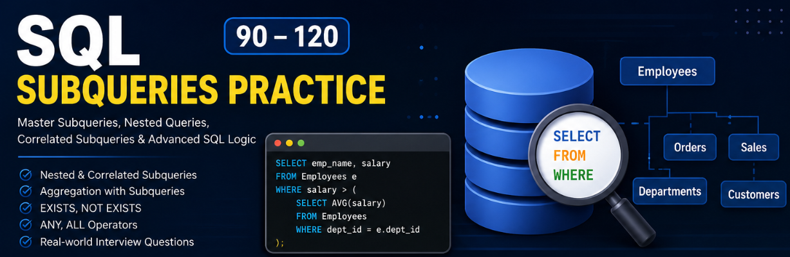

# SQL Subqueries Practice (91–120)



This folder contains **30 important SQL Subquery queries (91–120)** designed to practice **nested queries, correlated subqueries, aggregation, filtering, and advanced SQL logic**.

These queries are written using a **real-world Employee Management Database schema** and cover commonly asked **SQL interview questions** for **Data Analyst, Business Analyst, SQL Developer, and Data Science roles**.

---

## Topics Covered

### Salary-Based Analysis

* Employees with salary greater than average salary
* Employees with maximum salary
* Employees with minimum salary
* Employees with second highest salary
* Employees with third highest salary
* Salary greater than department average
* Employees earning above department average
* Employees with salary rank logic

### Department-Based Analysis

* Departments with highest average salary
* Departments with no employees
* Employees in departments with more than 5 employees
* Employees with maximum salary in department
* Employees with minimum salary in department
* Departments with salary greater than global average

### Employee & Customer Analysis

* Employees not in IT department
* Employees in same city as top earner
* Employees without orders
* Customers with no orders
* Employees matching multiple conditions

### Order & Sales Analysis

* Orders above average order value

### Subquery Concepts

* Nested subquery
* Correlated subquery
* Subquery in `SELECT`
* Subquery in `FROM`
* Subquery with aggregation

### Advanced SQL Operators

* `EXISTS`
* `NOT EXISTS`
* `ANY`
* `ALL`

---

## SQL Concepts Used

```sql
Subqueries
Nested Subqueries
Correlated Subqueries
Aggregate Functions
GROUP BY
HAVING
EXISTS
NOT EXISTS
ANY
ALL
IN
NOT IN
DENSE_RANK()
Window Functions
ORDER BY
LIMIT
```

---

## Learning Outcomes

By practicing these queries, you will learn:

* How to write SQL subqueries
* Nested and correlated query logic
* Department and salary-based analysis
* Advanced filtering techniques
* Aggregation with subqueries
* SQL interview problem solving
* Real-world business query scenarios

---

## Best For

✅ SQL Beginners to Intermediate Learners
✅ Data Analyst Preparation
✅ Business Analyst Interviews
✅ SQL Interview Practice
✅ Placement Preparation
✅ Real-world SQL Learning
