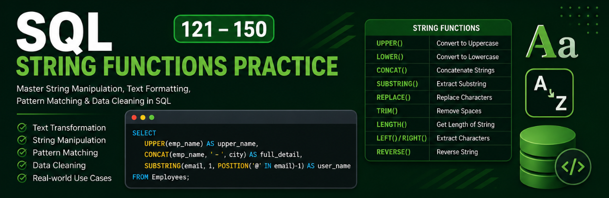

# SQL String Functions Practice (121–150)



This folder contains **30 important SQL String Function queries (121–150)** designed to practice **text manipulation, formatting, cleaning, and pattern matching in SQL**.

These queries are written using a **real-world Employee Management Database schema** and cover commonly asked **SQL interview questions** for **Data Analyst, Business Analyst, SQL Developer, and Data Science roles**.

---

## Topics Covered

### Case Conversion

* Convert names to **UPPERCASE**
* Convert names to **lowercase**

### String Length & Extraction

* Find length of names
* Extract first 3 characters
* Extract last 2 characters
* Extract substring
* Find position of substring

### String Formatting

* Concatenate name and city
* Format full name
* Capitalize first letter
* Mixed string formatting
* Create email format

### String Cleaning

* Remove extra spaces using `TRIM()`
* Left trim using `LTRIM()`
* Right trim using `RTRIM()`
* Remove special characters

### Pattern Matching

* Count names starting with `A`
* Find names ending with `y`
* Find names containing `'an'`

### Advanced String Operations

* Reverse string
* Repeat string
* Left padding
* Right padding
* Extract initials
* Count vowels in names

### Data Handling

* Replace NULL values with default values
* Extract domain from email
* Remove duplicate values

---

## SQL Functions Used

```sql
UPPER()
LOWER()
LENGTH()
LEFT()
RIGHT()
CONCAT()
REPLACE()
TRIM()
LTRIM()
RTRIM()
POSITION()
SUBSTRING()
LIKE
REVERSE()
REPEAT()
LPAD()
RPAD()
IFNULL()
DISTINCT()
SUBSTRING_INDEX()
```

---

## Learning Outcomes

By practicing these queries, you will learn:

* String manipulation in SQL
* Data cleaning techniques
* Text formatting for reporting
* Pattern matching using `LIKE`
* SQL interview preparation
* Real-world SQL text operations

---

## Best For

✅ SQL Beginners
✅ Data Analyst Preparation
✅ Business Analyst Interviews
✅ SQL Practice & Revision
✅ Placement Preparation
✅ Real-world SQL Learning
